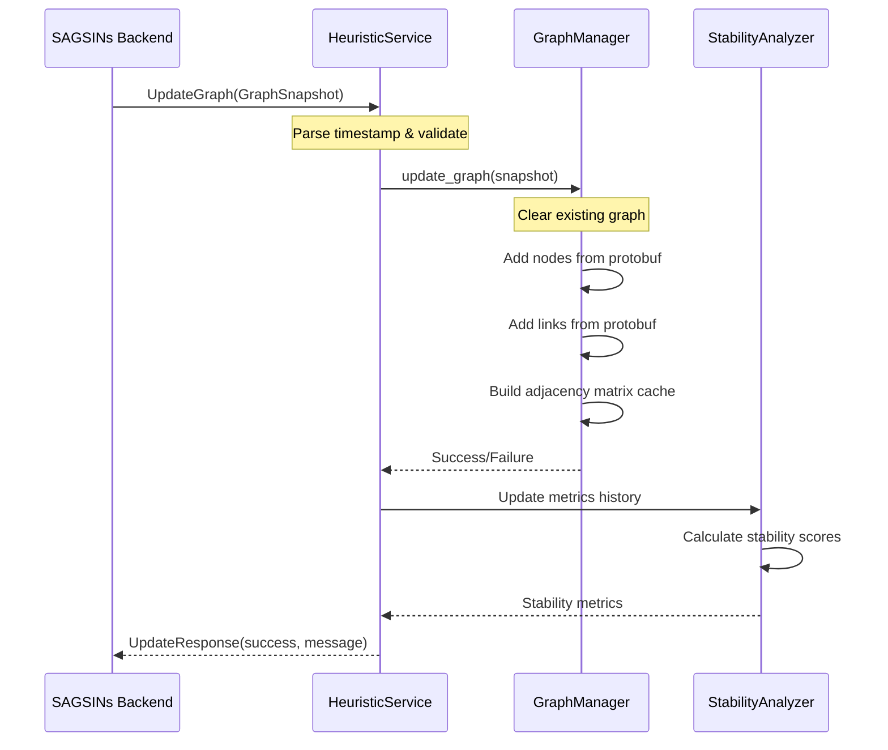
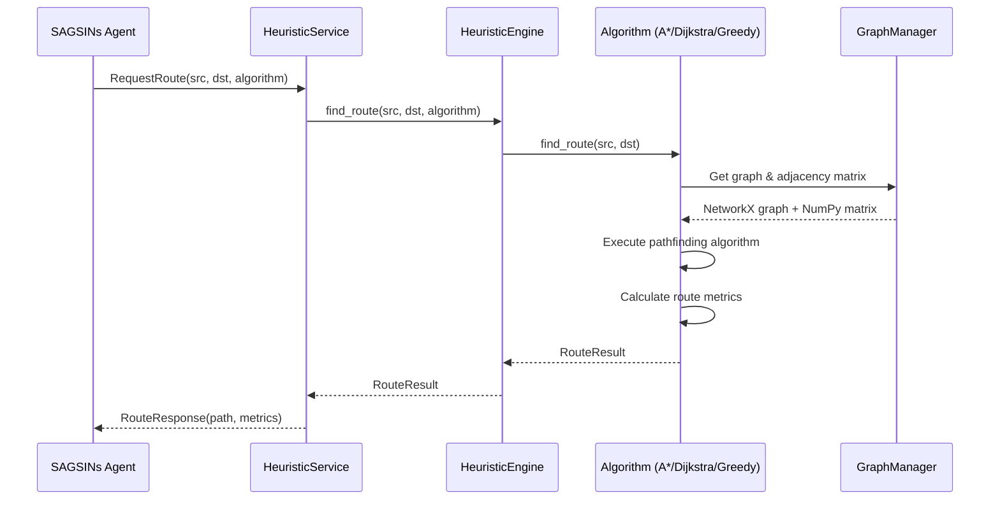
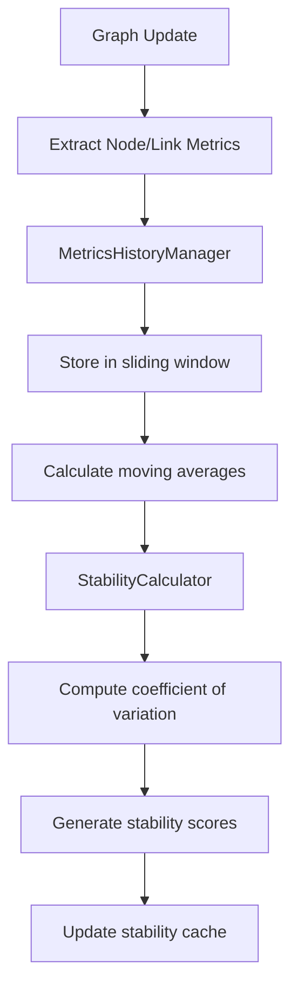

# 📊 Tổng Quan Dự Án: SAGSINs Heuristic Module

## 📋 Thông Tin Chung

### Tên Dự Án
**SAGSINs Heuristic Module** - Module tính toán heuristic cho mạng SAGSINs

### Mục Tiêu
Cung cấp dịch vụ tính toán tuyến đường tối ưu và phân tích độ ổn định mạng trong thời gian thực cho hệ thống SAGSINs (Software-defined Adaptive Ground-Satellite Integrated Networks).

### Công Nghệ Sử Dụng
- **Ngôn ngữ**: Python 3.11
- **Framework**: gRPC + AsyncIO
- **Thư viện chính**: 
  - NetworkX 3.3 (quản lý đồ thị)
  - NumPy (tính toán ma trận)
  - Loguru 0.7.2 (logging)
  - Protocol Buffers (giao tiếp)

---

## 🏗️ Kiến Trúc Hệ Thống

### 1. Kiến Trúc Tổng Thể

```
┌─────────────────────────────────────────────────────┐
│                SAGSINs Backend                      │
│              (Graph Updates)                        │
└─────────────────────┬───────────────────────────────┘
                      │ gRPC UpdateGraph
                      │ Every 3-5 seconds
                      ▼
┌─────────────────────────────────────────────────────┐
│             Heuristic Module                        │
│  ┌─────────────────────────────────────────────────┐ │
│  │           gRPC Service Layer                    │ │
│  │    (HeuristicServiceServicer)                   │ │
│  └─────────────────────────────────────────────────┘ │
│  ┌─────────────────────────────────────────────────┐ │
│  │          Service Orchestration                  │ │
│  │         (HeuristicEngine)                       │ │
│  └─────────────────────────────────────────────────┘ │
│  ┌──────────────┬──────────────┬──────────────────┐ │
│  │   Graph      │  Algorithms  │    Analysis     │ │
│  │  Management  │              │                 │ │
│  └──────────────┴──────────────┴──────────────────┘ │
└─────────────────────────────────────────────────────┘
                      │ Route Responses
                      ▼
┌─────────────────────────────────────────────────────┐
│               SAGSINs Agents                        │
│            (Route Requests)                         │
└─────────────────────────────────────────────────────┘
```

### 2. Kiến Trúc Module Chi Tiết

```
app/
├── main.py                 # Entry point - gRPC server
├── services/               # Lớp dịch vụ
│   ├── heuristic_service.py    # gRPC service handler
│   └── heuristic_engine.py     # Service orchestration
├── core/                   # Core business logic
│   └── graph/                  # Graph management
│       ├── graph_manager.py         # Main coordinator
│       ├── graph_operations.py      # NetworkX operations
│       ├── adjacency_manager.py     # NumPy matrix cache
│       ├── graph_stats.py           # Statistics & metrics
│       └── data_structures.py       # Data models
├── algorithms/             # Routing algorithms
│   ├── base.py                 # Base algorithm & RouteResult
│   ├── astar.py               # A* với network heuristics
│   ├── dijkstra.py            # Dijkstra shortest path
│   └── greedy.py              # Greedy best-first search
├── analysis/               # Stability analysis
│   ├── stability_analyzer.py      # Main coordinator
│   ├── history_manager.py         # Metrics history
│   ├── stability_calculator.py    # Statistical calculations
│   └── metrics.py                 # Data structures
└── utils/                  # Utilities
    └── logger.py               # Logging & performance monitoring
```

---

## 🔄 Luồng Hoạt Động Chính

### 1. Luồng Cập Nhật Đồ Thị (UpdateGraph RPC)



### 2. Luồng Tính Toán Tuyến Đường (RequestRoute RPC)



### 3. Luồng Phân Tích Độ Ổn Định



---

## 📦 Components Chính

### 1. **HeuristicService** (gRPC Interface)
- **Chức năng**: Điểm vào cho tất cả RPC calls
- **Responsibilities**:
  - Xử lý UpdateGraph từ SAGSINs Backend
  - Xử lý RequestRoute từ SAGSINs Agents
  - Logging và performance monitoring
  - Error handling và response formatting

### 2. **GraphManager** (Core Graph Management)
- **Chức năng**: Quản lý đồ thị mạng và caching
- **Components**:
  - `GraphOperations`: NetworkX graph operations
  - `AdjacencyManager`: NumPy matrix caching cho performance
  - `GraphStats`: Network statistics và centrality metrics
- **Features**:
  - Thread-safe graph updates
  - Real-time adjacency matrix caching
  - Node/link metrics tracking

### 3. **Algorithm Package** (Routing Algorithms)
- **Base Algorithm**: Abstract class với `RouteResult` dataclass
- **A* Algorithm**: Network-aware heuristic với delay/bandwidth weighting
- **Dijkstra Algorithm**: Classic shortest path cho reliability
- **Greedy Algorithm**: Best-first search cho real-time performance
- **Metrics Calculated**:
  - Total delay, jitter, loss rate
  - Minimum bandwidth, hop count
  - Stability score

### 4. **StabilityAnalyzer** (Network Stability)
- **MetricsHistoryManager**: Sliding window metrics storage
- **StabilityCalculator**: Statistical stability calculations
- **Features**:
  - Coefficient of variation tracking
  - Exponential moving averages
  - Network-wide stability monitoring
  - Anomaly detection capabilities

---

## 🚀 Deployment & Infrastructure

### Docker Containerization
```dockerfile
# Multi-stage build cho production
FROM python:3.11-slim
# Non-root user security
# Optimized dependencies installation
# Health checks ready
```

### Environment Configuration
```bash
HEURISTIC_LISTEN="0.0.0.0:50052"    # Server address
LOG_LEVEL="INFO"                     # Logging level
LOG_FILE="/app/logs/heuristic.log"   # Log file path
JSON_LOGS="false"                    # JSON log format
```

### Performance Characteristics
- **Graph Update Frequency**: 3-5 seconds từ Backend
- **Route Calculation**: Sub-millisecond response
- **Memory Usage**: O(V²) cho adjacency matrix cache
- **Scalability**: Supports networks với thousands of nodes

---

## 🔧 Integration Points

### 1. **SAGSINs Backend Integration**
- **Protocol**: gRPC với Protocol Buffers
- **Update Frequency**: Every 3-5 seconds
- **Data Format**: GraphSnapshot với nodes/links metrics
- **Error Handling**: Graceful degradation nếu updates fail

### 2. **SAGSINs Agents Integration**
- **Protocol**: gRPC RequestRoute calls
- **Response Format**: RouteResult với comprehensive metrics
- **Algorithm Selection**: A*/Dijkstra/Greedy based on requirements
- **Load Balancing**: Multiple agents có thể call concurrently

### 3. **Monitoring & Observability**
- **Structured Logging**: Loguru với JSON formatting option
- **Performance Metrics**: Execution time tracking cho all operations
- **Health Checks**: Graph statistics và system metrics
- **Error Tracking**: Detailed error logging với stack traces

---

## 📊 Performance & Scalability

### Memory Management
- **Graph Storage**: NetworkX cho flexibility
- **Matrix Cache**: NumPy cho fast path calculations
- **History Buffer**: Sliding window cho stability metrics
- **Memory Efficiency**: O(V + E) graph + O(V²) matrix cache

### Computational Complexity
- **Graph Update**: O(V + E) cho full rebuild
- **A* Pathfinding**: O(V log V) với good heuristics
- **Dijkstra**: O((V + E) log V) guaranteed optimal
- **Greedy**: O(V + E) cho fastest response

### Concurrent Operations
- **Thread Safety**: All graph operations are thread-safe
- **Async Processing**: gRPC async server cho high throughput
- **Resource Management**: Proper cleanup và error handling
- **Scalability**: Horizontal scaling với multiple instances

---

## 🎯 Business Value

### 1. **Network Optimization**
- Real-time route optimization based on current network conditions
- Multiple algorithm choices cho different optimization goals
- Comprehensive metrics cho informed routing decisions

### 2. **Stability Monitoring**
- Proactive network stability analysis
- Historical trend tracking cho predictive maintenance
- Anomaly detection cho early problem identification

### 3. **Production Readiness**
- Docker containerization cho easy deployment
- Comprehensive logging và monitoring
- Error handling và graceful degradation
- Performance optimization cho production loads

---

## 🔮 Future Enhancements

### Planned Features
1. **Machine Learning Integration**: ML-based route prediction
2. **Advanced Heuristics**: Custom heuristics cho specific network types
3. **Real-time Analytics**: WebSocket streams cho real-time monitoring
4. **Distributed Processing**: Multi-node processing cho large networks
5. **API Extensions**: REST API alongside gRPC cho broader integration

### Technical Improvements
1. **Performance Optimization**: GPU acceleration cho large matrix operations
2. **Memory Optimization**: Compressed storage cho large network histories
3. **Algorithm Extensions**: Additional pathfinding algorithms
4. **Monitoring Enhancement**: Prometheus metrics integration
5. **Testing**: Comprehensive integration và performance testing
